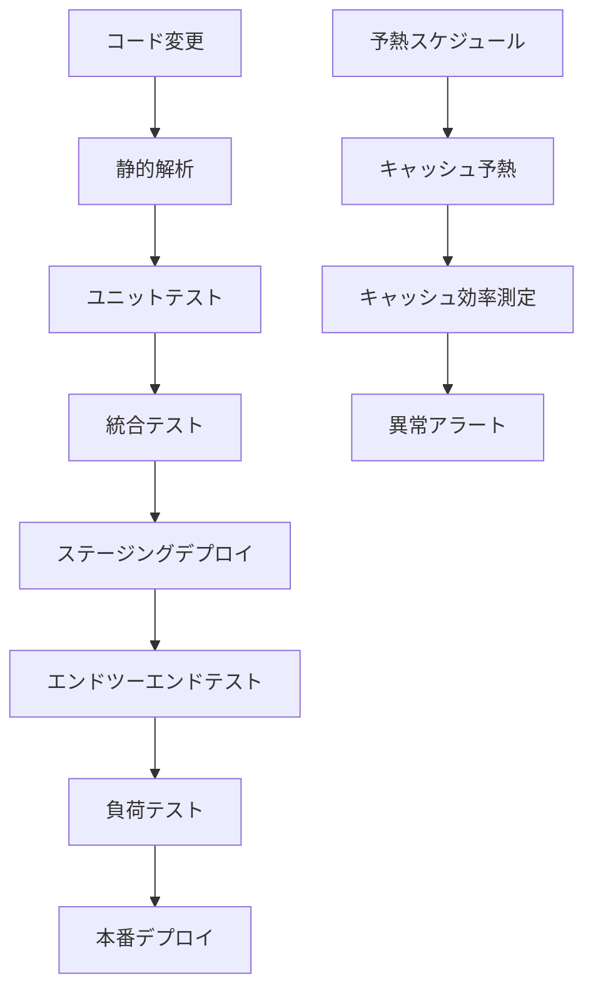

# Portfolio Market Data API テスト計画書

## 1. テスト戦略概要

このテスト計画は、Portfolio Market Data API の品質と信頼性を確保するためのものです。テストは以下の原則に基づいて設計・実行されます：

- **包括的カバレッジ**: コードベース全体をカバーする多層的なテスト戦略
- **自動化優先**: CI/CDパイプラインに統合できる自動テストを優先的に作成
- **変更箇所重点**: リファクタリングによる変更部分に特に注目したテスト設計
- **段階的実行**: 単体テストから始め、統合テスト、負荷テストと段階的にテストを進行
- **環境分離**: モックとスタブを活用し、実際の外部依存からテストを分離

テストは4つの主要カテゴリに分けて実施します：ユニットテスト、統合テスト、エンドツーエンドテスト、負荷テストです。

## 2. ユニットテスト計画

### 2.1 ユニティリティモジュールのテスト

| テスト対象 | テスト内容 | 優先度 |
|------------|------------|--------|
| `responseUtils.js` | 成功レスポンス、エラーレスポンス、リダイレクトレスポンス、CORS対応の各フォーマット関数のテスト | 高 |
| `cookieParser.js` | Cookie解析・生成・削除機能のテスト | 高 |
| `budgetCheck.js` | 予算チェック機能とレスポンス修飾機能のテスト | 中 |
| `retry.js` | 再試行ロジック、バックオフ戦略、エラー判定のテスト | 中 |
| `errorHandler.js` | エラータイプ別ハンドリングとエラーレスポンス生成機能のテスト | 高 |
| `dataFetchUtils.js` | ユーザーエージェント生成、エラー記録、ブラックリストチェック機能のテスト | 中 |
| `dataFetchWithFallback.js` | 複数ソースからのデータ取得とフォールバック機能のテスト | 高 |
| `dataValidation.js` | 価格変動検証、複数ソース整合性検証機能のテスト | 中 |
| `scrapingBlacklist.js` | ブラックリスト登録・確認・解除・クリーンアップ機能のテスト | 高 |
| `logger.js` | 各ログレベルの出力機能のテスト | 低 |
| `dynamoDbService.js` | DynamoDB CRUD操作のテスト | 高 |
| `awsConfig.js` | AWS SDKクライアント取得とリージョン設定のテスト | 中 |

### 2.2 サービスモジュールのテスト

| テスト対象 | テスト内容 | 優先度 |
|------------|------------|--------|
| `cache.js` | キャッシュの取得・保存・削除・クリーンアップ、TTL計算機能のテスト | 高 |
| `alerts.js` | アラート通知、スロットリング、エラー通知機能のテスト | 中 |
| `usage.js` | 使用量カウント・チェック・リセット、閾値通知機能のテスト | 高 |
| `googleAuthService.js` | 認証・セッション・トークン管理、Drive操作機能のテスト | 高 |
| `fallbackDataStore.js` | GitHubフォールバックデータの取得・記録・エクスポート機能のテスト | 高 |
| `metrics.js` | データソース優先度管理、パフォーマンス測定機能のテスト | 中 |
| `enhancedMarketDataService.js` | 各資産タイプのデータ取得、統合キャッシュ対応のテスト | 高 |
| `yahooFinance.js` | Yahoo Finance API単一・バッチ取得機能のテスト | 中 |
| `exchangeRate.js` | 複数ソースからの為替レート取得機能のテスト | 中 |
| `fundDataService.js` | 投資信託データ取得、CSV解析機能のテスト | 中 |
| `marketDataProviders.js` | 各スクレイピングソースとフォールバック動作のテスト | 中 |

### 2.3 モックとスタブの作成

- **AWS SDK モック**: DynamoDB、SNS、STSなどのAWSサービスのモック
- **外部API モック**: Yahoo Finance API、為替API、Webスクレイピングのモック
- **環境変数スタブ**: テスト環境用の環境変数設定
- **GitHubフォールバックデータモック**: フォールバックデータ取得のモック
- **APIサーバーモック**: E2Eテスト用のAPIレスポンスモック

### 2.4 テストスイート構成

```
__tests__/
  unit/
    utils/
      responseUtils.test.js
      cookieParser.test.js
      retry.test.js
      errorHandler.test.js
      dataFetchUtils.test.js
      dataFetchWithFallback.test.js
      dataValidation.test.js
      scrapingBlacklist.test.js
      awsConfig.test.js
      ...
    services/
      cache.test.js
      alerts.test.js
      usage.test.js
      googleAuthService.test.js
      fallbackDataStore.test.js
      metrics.test.js
      enhancedMarketDataService.test.js
      yahooFinance.test.js
      exchangeRate.test.js
      fundDataService.test.js
      marketDataProviders.test.js
      ...
```

## 3. 統合テスト計画

### 3.1 ハンドラー関数のテスト

| テスト対象 | テスト内容 | 優先度 |
|------------|------------|--------|
| `marketData.js` | 各データタイプ（米国株、日本株、投資信託、為替）取得ハンドラーのテスト | 高 |
| `googleLogin.js` | Google認証ハンドラーのテスト | 高 |
| `getSession.js` | セッション取得ハンドラーのテスト | 高 |
| `logout.js` | ログアウトハンドラーのテスト | 中 |
| `saveFile.js` | Google Driveファイル保存ハンドラーのテスト | 高 |
| `loadFile.js` | Google Driveファイル読み込みハンドラーのテスト | 高 |
| `listFiles.js` | Google Driveファイル一覧ハンドラーのテスト | 中 |
| `getStatus.js` | API使用状況取得ハンドラーのテスト | 中 |
| `resetUsage.js` | 使用量リセットハンドラーのテスト | 中 |
| `getBudgetStatus.js` | 予算状況取得ハンドラーのテスト | 中 |
| `manageFallbacks.js` | フォールバックデータ管理ハンドラーのテスト | 中 |
| `preWarmCache.js` | キャッシュ予熱ハンドラーのテスト | 高 |

### 3.2 エンドツーエンドフローのテスト

| テストフロー | テスト内容 | 優先度 |
|--------------|------------|--------|
| 認証フロー | ログイン、セッション検証、ログアウトの一連の流れ | 高 |
| データ取得フロー | キャッシュミス→データ取得→キャッシュヒットの流れ | 高 |
| フォールバックフロー | メインソース失敗→フォールバック使用の流れ | 高 |
| マルチソースフロー | 複数データソースからの取得と統合の流れ | 中 |
| Google Drive連携フロー | ファイル保存→一覧取得→ファイル読み込みの流れ | 中 |
| 管理者操作フロー | ステータス取得→使用量リセット→ステータス再取得の流れ | 中 |
| キャッシュ予熱フロー | 予熱→キャッシュ確認→クリーンアップの流れ | 中 |
| 予算警告フロー | 予算使用率増加→警告表示→制限適用の流れ | 中 |

### 3.3 API エンドポイントのテスト

各APIエンドポイントに対して以下のテストを実施:

- 正常系リクエスト（各データタイプ、各パラメータ組み合わせ）
- 異常系リクエスト（不正パラメータ、存在しない銘柄）
- 認証失敗のケース（無効APIキー、期限切れセッション）
- 制限超過のケース（日次・月次制限超過）
- キャッシュ動作確認（TTL検証、更新確認）
- CORSヘッダーの確認
- バッジ処理の検証（複数銘柄同時リクエスト）

### 3.4 モックサーバーの構築

- **LocalStack**: AWSサービス（DynamoDB, SNS）のローカルエミュレーション
- **WireMock**: 外部API（Yahoo Finance, 為替レートAPI）のモック
- **MockServer**: スクレイピングターゲットWebサイトのモック
- **インメモリデータベース**: DynamoDBのエミュレーション
- **Google OAuth2モック**: Google認証のエミュレーション
- **APIモックサーバー**: E2Eテスト用の完全モック環境

## 4. 負荷テスト計画

### 4.1 パフォーマンステスト

| テスト対象 | テスト内容 | 目標値 | 優先度 |
|------------|------------|--------|--------|
| レスポンス時間 | 平均・95パーセンタイルレスポンス時間の測定 | 平均<500ms、95%<1000ms | 高 |
| スループット | 1秒あたりの処理可能リクエスト数 | >100req/s | 中 |
| コールドスタート | Lambda関数の初回起動時間 | <2000ms | 中 |
| キャッシュ応答時間 | キャッシュヒット時のレスポンス時間 | <100ms | 高 |
| フォールバック応答時間 | メインソース失敗時のフォールバック応答時間 | <1000ms | 中 |

### 4.2 エンデュランステスト

- **持続的負荷**: 中程度の負荷（50req/s）を30分間維持
- **段階的負荷増加**: 10req/sから徐々に100req/sまで増加
- **回復テスト**: 高負荷後のシステム回復能力の検証
- **定期実行テスト**: キャッシュ予熱関数の定期実行影響を検証

### 4.3 キャッシュ効率のテスト

- **キャッシュヒット率**: 異なるアクセスパターンでのヒット率測定
- **キャッシュサイズ**: 様々なサイズのデータに対するキャッシュ効率測定
- **キャッシュ無効化**: TTL期限切れとクリーンアップ処理のテスト
- **動的TTL**: ボラティリティに基づく動的TTL調整の効果測定

### 4.4 フォールバックシナリオのテスト

- **段階的フォールバック**: メインソース→代替ソース→GitHubフォールバック→デフォルト値の流れ
- **ブラックリスト効果**: ブラックリスト適用による性能向上の測定
- **データソース異常**: 各データソースの障害シミュレーションとシステム応答

### 4.5 使用ツール

- **Artillery**: HTTP負荷テスト
- **AWS CloudWatch**: メトリクス収集・モニタリング
- **X-Ray**: トレースとパフォーマンス分析
- **カスタムツール**: 特定シナリオのシミュレーション

## 5. テスト環境のセットアップ

### 5.1 ローカル開発環境

```bash
# Jest と必要なテストライブラリのインストール
npm install --save-dev jest aws-sdk-mock nock sinon supertest mock-fs cross-env

# DynamoDB Local のセットアップ（初回のみ）
mkdir -p ./dynamodb-local
curl -L -o ./dynamodb-local/dynamodb-local-latest.tar.gz https://d1ni2b6xgvw0s0.cloudfront.net/dynamodb_local_latest.tar.gz
tar -xzf ./dynamodb-local/dynamodb-local-latest.tar.gz -C ./dynamodb-local

# テスト環境セットアップスクリプトに実行権限を付与
chmod +x scripts/setup-test-env.js
chmod +x scripts/run-tests.sh
```

### 5.2 テスト設定ファイル（jest.config.js）

```javascript
module.exports = {
  // テストファイルのパターン
  testMatch: [
    "**/__tests__/**/*.test.js",
    "**/__tests__/**/*_test.js"
  ],
  
  // テスト環境
  testEnvironment: "node",
  
  // 除外するディレクトリ
  testPathIgnorePatterns: [
    "/node_modules/",
    "/dynamodb-local/"
  ],
  
  // テストのタイムアウト設定
  testTimeout: 30000, // 30秒（E2Eテストの場合は長めに設定）
  
  // テスト実行前のセットアップファイル
  setupFilesAfterEnv: [
    "<rootDir>/__tests__/setup.js"
  ],
  
  // テストカバレッジの設定
  collectCoverage: process.env.COLLECT_COVERAGE === 'true',
  coverageDirectory: '<rootDir>/coverage',
  collectCoverageFrom: [
    "src/**/*.js",
    "!src/local/**",
    "!**/node_modules/**"
  ],
  
  // テストの分類設定
  projects: [
    {
      displayName: 'unit',
      testMatch: ['**/__tests__/unit/**/*.test.js'],
      testEnvironment: 'node'
    },
    {
      displayName: 'integration',
      testMatch: ['**/__tests__/integration/**/*.test.js'],
      testEnvironment: 'node'
    },
    {
      displayName: 'e2e',
      testMatch: ['**/__tests__/e2e/**/*_test.js', '**/__tests__/e2e/**/*.test.js'],
      testEnvironment: 'node',
      // E2Eテストは環境変数でスキップ可能
      testPathIgnorePatterns: process.env.SKIP_E2E_TESTS === 'true' ? ['.*'] : []
    }
  ]
};
```

### 5.3 テスト用環境変数（.env.test）

```
# テスト用.env.test ファイル例
NODE_ENV=test
AWS_REGION=us-east-1
DYNAMODB_ENDPOINT=http://localhost:8000
DYNAMODB_TABLE_PREFIX=test-portfolio-market-data-
SESSION_TABLE=test-sessions
DAILY_REQUEST_LIMIT=100
MONTHLY_REQUEST_LIMIT=1000
DISABLE_ON_LIMIT=true
GOOGLE_CLIENT_ID=test-client-id
GOOGLE_CLIENT_SECRET=test-client-secret
DRIVE_FOLDER_NAME=TestPortfolioManagerData
CACHE_TIME_US_STOCK=3600
CACHE_TIME_JP_STOCK=3600
CACHE_TIME_MUTUAL_FUND=10800
CACHE_TIME_EXCHANGE_RATE=21600
DEFAULT_EXCHANGE_RATE=148.5
YAHOO_FINANCE_API_KEY=test-api-key
YAHOO_FINANCE_API_HOST=yh-finance.p.rapidapi.com
EXCHANGE_RATE_API_KEY=test-api-key
ADMIN_EMAIL=admin@example.com
ADMIN_API_KEY=test-admin-api-key
SCRAPING_MAX_FAILURES=3
SCRAPING_COOLDOWN_DAYS=7
API_TEST_URL=http://localhost:3000/dev
USE_API_MOCKS=false
RUN_E2E_TESTS=false
```

### 5.4 テスト環境セットアップスクリプト

テスト環境を自動的にセットアップするスクリプトを追加しました。このスクリプトは次の機能を提供します：

- DynamoDB Local の自動起動
- テストディレクトリの作成
- 環境変数の設定
- テスト実行の準備

```javascript
// scripts/setup-test-env.js
// DynamoDB Localの起動やテスト環境の準備を行う
```

テスト実行を簡易化するスクリプトも追加しました：

```bash
// scripts/run-tests.sh
// さまざまなテストパターンを簡単に実行するためのスクリプト
```

## 6. テストスケジュール

| フェーズ | 作業内容 | 期間 | 開始日 | 終了日 |
|---------|----------|------|--------|--------|
| 準備 | テスト環境構築、モック・スタブ作成 | 3日 | 2025/05/20 | 2025/05/22 |
| フェーズ1 | ユーティリティ・基本サービスのユニットテスト | 3日 | 2025/05/23 | 2025/05/25 |
| フェーズ2 | データソース・拡張サービスのユニットテスト | 3日 | 2025/05/26 | 2025/05/28 |
| フェーズ3 | マーケットデータ・認証系統合テスト | 3日 | 2025/05/29 | 2025/05/31 |
| フェーズ4 | 管理機能・Drive連携系統合テスト | 2日 | 2025/06/01 | 2025/06/02 |
| フェーズ5 | エンドツーエンドフローテスト | 3日 | 2025/06/03 | 2025/06/05 |
| フェーズ6 | フォールバック・障害シナリオテスト | 2日 | 2025/06/06 | 2025/06/07 |
| フェーズ7 | 負荷テスト・パフォーマンステスト | 3日 | 2025/06/08 | 2025/06/10 |
| フェーズ8 | 修正・再テスト | 2日 | 2025/06/11 | 2025/06/12 |
| レポート | テスト結果分析・レポート作成 | 2日 | 2025/06/13 | 2025/06/14 |

## 7. 合格基準

### 7.1 機能的基準

- **ユニットテスト**: 全テストケース成功、コードカバレッジ80%以上
- **統合テスト**: 全APIエンドポイントの正常・異常系テスト成功
- **エンドツーエンド**: 全ユーザーシナリオのテスト成功
- **フォールバック**: 全データタイプでフォールバック機能の正常動作確認

### 7.2 非機能的基準

- **パフォーマンス**: 平均応答時間500ms未満、95パーセンタイル1000ms未満
- **スケーラビリティ**: 100req/秒の処理能力を維持
- **回復性**: 負荷後の正常動作回復時間5秒未満
- **キャッシュ効率**: キャッシュヒット率80%以上（通常使用パターン時）

### 7.3 リグレッション検証

- リファクタリング前と同等以上の機能性を維持
- 既存機能の破壊が発生していないことを確認
- 全データタイプでの取得成功率99%以上

## 8. リスク管理とコンティンジェンシープラン

### 8.1 識別されたリスク

| リスク | 影響度 | 発生確率 | 対策 |
|--------|--------|----------|------|
| テスト漏れによる未検出バグ | 高 | 中 | カバレッジ測定強化、コードレビュー、メトリクスモニタリング |
| 外部API依存によるテスト不安定性 | 中 | 高 | モックの強化、冪等性のあるテスト設計、実行リトライ機能 |
| スクレイピング対象サイト変更 | 高 | 高 | 定期的なスクレイパーチェック、フォールバック強化、アラート設定 |
| 環境差異によるテスト失敗 | 中 | 中 | Docker化、環境設定の明確化、環境変数管理の徹底 |
| 認証連携の複雑さ | 中 | 中 | Google OAuth2モックの精緻化、テスト用認証フロー簡略化 |
| 負荷テスト中のコスト増大 | 低 | 高 | テスト時間制限、コスト監視、ローカル環境でのシミュレーション強化 |
| APIサーバー起動失敗 | 中 | 高 | APIモックの活用、自動起動オプションの提供、フォールバック戦略の実装 |

### 8.2 コンティンジェンシープラン

- **重大なバグ発見時**: デプロイを中断し、緊急フィックスチームを編成、フォールバックシステムの確認
- **テスト環境障害**: バックアップ環境への切り替え、ローカルエミュレーション環境の活用
- **スクレイピング失敗増加**: GitHub上のフォールバックデータを手動更新、代替データソースへの一時切り替え
- **外部API障害**: モックレスポンスによるテスト継続、障害状況をテスト結果に注記
- **スケジュール遅延**: クリティカルパステストを優先し、並行作業で遅延を最小化
- **E2Eテスト障害**: APIモックモードに切り替えて基本テストを実行、詳細検証は後日に延期

## 9. テスト自動化とCIプロセス

### 9.1 CI/CDパイプライン統合



### 9.2 GitHub Actions ワークフロー設定

```yaml
name: テスト自動化ワークフロー

on:
  push:
    branches: [ main, develop ]
  pull_request:
    branches: [ main, develop ]

jobs:
  test:
    name: テスト実行
    runs-on: ubuntu-latest
    
    strategy:
      matrix:
        node-version: [18.x]
    
    steps:
    - name: リポジトリのチェックアウト
      uses: actions/checkout@v3
    
    - name: Node.js ${{ matrix.node-version }} のセットアップ
      uses: actions/setup-node@v3
      with:
        node-version: ${{ matrix.node-version }}
        cache: 'npm'
    
    - name: DynamoDB Localのセットアップ
      run: |
        mkdir -p ./dynamodb-local
        curl -L -o ./dynamodb-local/dynamodb-local-latest.tar.gz https://d1ni2b6xgvw0s0.cloudfront.net/dynamodb_local_latest.tar.gz
        tar -xzf ./dynamodb-local/dynamodb-local-latest.tar.gz -C ./dynamodb-local
        java -version
    
    - name: 依存関係のインストール
      run: npm ci
    
    - name: 単体テスト実行
      run: npm run test:unit
      env:
        NODE_ENV: test
        CI: true
        COLLECT_COVERAGE: true
    
    - name: 統合テスト実行
      run: npm run test:integration
      env:
        NODE_ENV: test
        CI: true
        COLLECT_COVERAGE: true
    
    - name: E2Eテスト実行（モック使用）
      run: npm run test:e2e:mock
      env:
        NODE_ENV: test
        CI: true
        USE_API_MOCKS: true
        COLLECT_COVERAGE: true
    
    - name: カバレッジレポートのアップロード
      uses: codecov/codecov-action@v3
      with:
        directory: ./coverage
    
    - name: テスト結果のアップロード
      uses: actions/upload-artifact@v3
      if: always()
      with:
        name: test-results
        path: ./test-results
        retention-days: 30
```

### 9.3 自動テスト実行設定

- **コミット時**: リンター・フォーマッター自動実行
- **プッシュ時**: 静的解析・ユニットテスト自動実行（ユーティリティと基本サービス）
- **PRオープン時**: 全ユニットテスト・基本統合テスト自動実行
- **PRマージ時**: 統合テスト・エンドツーエンドテスト自動実行
- **定期実行**: 毎日夜間に全テスト実行、週次で負荷テスト実行
- **リリース前**: 完全なテストスイート実行（負荷テスト含む）

### 9.4 テスト実行方法

テスト実行方法を改善し、さまざまなオプションを提供します：

- **基本実行**: `npm test`
- **単体テスト**: `npm run test:unit`
- **統合テスト**: `npm run test:integration`
- **E2Eテスト**: `npm run test:e2e`
- **APIモック使用**: `npm run test:e2e:mock`
- **APIサーバー自動起動**: `npm run test:e2e:auto`
- **高速テスト**: `npm run test:quick`
- **完全テスト（モック）**: `npm run test:full:mock`
- **完全テスト（自動起動）**: `npm run test:full:auto`

## 10. テストコード例

### 10.1 ユニットテスト例（dataFetchWithFallback.js）

```javascript
// __tests__/unit/utils/dataFetchWithFallback.test.js
const { fetchDataWithFallback } = require('../../../src/utils/dataFetchWithFallback');
const cacheService = require('../../../src/services/cache');
const fallbackDataStore = require('../../../src/services/fallbackDataStore');
const blacklist = require('../../../src/utils/scrapingBlacklist');

// モック
jest.mock('../../../src/services/cache');
jest.mock('../../../src/services/fallbackDataStore');
jest.mock('../../../src/utils/scrapingBlacklist');

describe('dataFetchWithFallback', () => {
  beforeEach(() => {
    jest.resetAllMocks();
  });

  test('キャッシュヒット時のデータ取得', async () => {
    // キャッシュヒットをシミュレート
    const cachedData = {
      ticker: 'AAPL',
      price: 190.5,
      change: 2.3,
      changePercent: 1.2,
      source: 'Cache'
    };
    
    cacheService.get.mockResolvedValue(cachedData);
    
    const options = {
      symbol: 'AAPL',
      dataType: 'us-stock',
      fetchFunctions: [
        jest.fn()
      ],
      defaultValues: {
        price: 100,
        change: 0,
        changePercent: 0
      }
    };
    
    const result = await fetchDataWithFallback(options);
    
    // 検証
    expect(result).toEqual(expect.objectContaining({
      ticker: 'AAPL',
      price: 190.5,
      fromCache: true
    }));
    
    // キャッシュのみチェックされ、データ取得関数は呼ばれていないこと
    expect(cacheService.get).toHaveBeenCalledWith('us-stock:AAPL');
    expect(options.fetchFunctions[0]).not.toHaveBeenCalled();
  });
  
  test('データ取得成功時のキャッシュ保存', async () => {
    // キャッシュミス、ブラックリストなし、データ取得成功をシミュレート
    cacheService.get.mockResolvedValue(null);
    blacklist.isBlacklisted.mockResolvedValue(false);
    
    const fetchedData = {
      price: 190.5,
      change: 2.3,
      changePercent: 1.2,
      source: 'Yahoo Finance API'
    };
    
    const fetchFunction = jest.fn().mockResolvedValue(fetchedData);
    
    const options = {
      symbol: 'AAPL',
      dataType: 'us-stock',
      fetchFunctions: [fetchFunction],
      defaultValues: {
        price: 100,
        change: 0,
        changePercent: 0
      }
    };
    
    const result = await fetchDataWithFallback(options);
    
    // 検証
    expect(result).toEqual(expect.objectContaining({
      ticker: 'AAPL',
      price: 190.5,
      source: 'Yahoo Finance API'
    }));
    
    // キャッシュチェック、データ取得、キャッシュ保存が行われたこと
    expect(cacheService.get).toHaveBeenCalledWith('us-stock:AAPL');
    expect(fetchFunction).toHaveBeenCalledWith('AAPL');
    expect(blacklist.recordSuccess).toHaveBeenCalledWith('AAPL');
    expect(cacheService.set).toHaveBeenCalledWith(
      'us-stock:AAPL',
      expect.objectContaining({ price: 190.5 }),
      expect.any(Number)
    );
  });
  
  test('メインソース失敗時のフォールバック', async () => {
    // キャッシュミス、ブラックリストなし、メインソース失敗、フォールバック成功をシミュレート
    cacheService.get.mockResolvedValue(null);
    blacklist.isBlacklisted.mockResolvedValue(false);
    
    const mainFetchFunction = jest.fn().mockRejectedValue(new Error('API error'));
    const fallbackFetchFunction = jest.fn().mockResolvedValue({
      price: 190.5,
      change: 2.3,
      changePercent: 1.2,
      source: 'Yahoo Finance (Web)'
    });
    
    const options = {
      symbol: 'AAPL',
      dataType: 'us-stock',
      fetchFunctions: [mainFetchFunction, fallbackFetchFunction],
      defaultValues: {
        price: 100,
        change: 0,
        changePercent: 0
      }
    };
    
    const result = await fetchDataWithFallback(options);
    
    // 検証
    expect(result).toEqual(expect.objectContaining({
      ticker: 'AAPL',
      price: 190.5,
      source: 'Yahoo Finance (Web)'
    }));
    
    // 両方のデータ取得関数が呼ばれたこと
    expect(mainFetchFunction).toHaveBeenCalledWith('AAPL');
    expect(fallbackFetchFunction).toHaveBeenCalledWith('AAPL');
    expect(blacklist.recordFailure).toHaveBeenCalledWith(
      'AAPL',
      'us-stock',
      expect.stringContaining('API error')
    );
  });
  
  test('ブラックリスト銘柄のフォールバック処理', async () => {
    // キャッシュミス、ブラックリスト有効をシミュレート
    cacheService.get.mockResolvedValue(null);
    blacklist.isBlacklisted.mockResolvedValue(true);
    
    const fallbackData = {
      ticker: 'AAPL',
      price: 190.5,
      change: 2.3,
      changePercent: 1.2,
      source: 'GitHub Fallback'
    };
    
    fallbackDataStore.getFallbackForSymbol.mockResolvedValue(fallbackData);
    
    const fetchFunction = jest.fn(); // 呼ばれないはず
    
    const options = {
      symbol: 'AAPL',
      dataType: 'us-stock',
      fetchFunctions: [fetchFunction],
      defaultValues: {
        price: 100,
        change: 0,
        changePercent: 0
      }
    };
    
    const result = await fetchDataWithFallback(options);
    
    // 検証
    expect(result).toEqual(expect.objectContaining({
      ticker: 'AAPL',
      price: 190.5,
      isBlacklisted: true,
      source: 'GitHub Fallback'
    }));
    
    // データ取得関数は呼ばれずにフォールバックデータが使用されたこと
    expect(fetchFunction).not.toHaveBeenCalled();
    expect(fallbackDataStore.getFallbackForSymbol).toHaveBeenCalledWith('AAPL', 'us-stock');
  });
  
  test('全てのソースが失敗した場合のデフォルト値使用', async () => {
    // キャッシュミス、ブラックリストなし、全ソース失敗、GitHubフォールバックなしをシミュレート
    cacheService.get.mockResolvedValue(null);
    blacklist.isBlacklisted.mockResolvedValue(false);
    fallbackDataStore.getFallbackForSymbol.mockResolvedValue(null);
    
    const fetch1 = jest.fn().mockRejectedValue(new Error('API error'));
    const fetch2 = jest.fn().mockRejectedValue(new Error('Scraping error'));
    
    const options = {
      symbol: 'AAPL',
      dataType: 'us-stock',
      fetchFunctions: [fetch1, fetch2],
      defaultValues: {
        price: 100,
        change: 0,
        changePercent: 0,
        name: 'AAPL'
      }
    };
    
    const result = await fetchDataWithFallback(options);
    
    // 検証
    expect(result).toEqual(expect.objectContaining({
      ticker: 'AAPL',
      price: 100,
      source: 'Default Fallback'
    }));
    
    // 失敗が記録されたこと
    expect(fallbackDataStore.recordFailedFetch).toHaveBeenCalledWith(
      'AAPL',
      'us-stock',
      expect.stringContaining('All sources failed')
    );
  });
});
```

### 10.2 統合テスト例（marketData.js）

```javascript
// __tests__/integration/function/marketData.test.js
const { handler } = require('../../../src/function/marketData');
const enhancedMarketDataService = require('../../../src/services/sources/enhancedMarketDataService');
const cacheService = require('../../../src/services/cache');
const usageService = require('../../../src/services/usage');

// モック
jest.mock('../../../src/services/sources/enhancedMarketDataService');
jest.mock('../../../src/services/cache');
jest.mock('../../../src/services/usage');
jest.mock('../../../src/utils/budgetCheck', () => ({
  isBudgetCritical: jest.fn().mockResolvedValue(false),
  getBudgetWarningMessage: jest.fn().mockResolvedValue(null),
  addBudgetWarningToResponse: jest.fn(response => response)
}));

describe('Market Data Handler', () => {
  beforeEach(() => {
    jest.resetAllMocks();
    
    // 共通のモック応答設定
    usageService.checkAndUpdateUsage.mockResolvedValue({
      allowed: true,
      usage: {
        daily: { count: 10, limit: 5000, percentage: 0.2 },
        monthly: { count: 100, limit: 100000, percentage: 0.1 }
      }
    });
  });

  describe('米国株データ取得', () => {
    test('単一銘柄の取得', async () => {
      // モック設定
      const applData = {
        ticker: 'AAPL',
        price: 190.5,
        change: 2.3,
        changePercent: 1.2,
        name: 'Apple Inc.',
        currency: 'USD',
        lastUpdated: '2025-05-11T12:00:00Z',
        source: 'Yahoo Finance API'
      };
      
      enhancedMarketDataService.getUsStocksData.mockResolvedValue({
        AAPL: applData
      });
      
      // テストリクエスト実行
      const event = {
        httpMethod: 'GET',
        queryStringParameters: {
          type: 'us-stock',
          symbols: 'AAPL'
        },
        headers: {
          'User-Agent': 'test-agent',
          'X-Forwarded-For': '192.168.1.1'
        }
      };
      
      const response = await handler(event);
      
      // レスポンス検証
      expect(response.statusCode).toBe(200);
      
      const body = JSON.parse(response.body);
      expect(body.success).toBe(true);
      expect(body.data.AAPL).toEqual(applData);
      
      // モック呼び出し検証
      expect(usageService.checkAndUpdateUsage).toHaveBeenCalledWith({
        dataType: 'us-stock',
        ip: '192.168.1.1',
        userAgent: 'test-agent',
        sessionId: undefined
      });
      
      expect(enhancedMarketDataService.getUsStocksData).toHaveBeenCalledWith(['AAPL'], false);
    });
    
    test('複数銘柄の取得', async () => {
      // モック設定
      const stocksData = {
        AAPL: {
          ticker: 'AAPL',
          price: 190.5,
          change: 2.3,
          changePercent: 1.2,
          name: 'Apple Inc.',
          currency: 'USD'
        },
        MSFT: {
          ticker: 'MSFT',
          price: 380.2,
          change: 5.1,
          changePercent: 1.4,
          name: 'Microsoft Corporation',
          currency: 'USD'
        }
      };
      
      enhancedMarketDataService.getUsStocksData.mockResolvedValue(stocksData);
      
      // テストリクエスト実行
      const event = {
        httpMethod: 'GET',
        queryStringParameters: {
          type: 'us-stock',
          symbols: 'AAPL,MSFT',
          refresh: 'true'
        },
        headers: {}
      };
      
      const response = await handler(event);
      
      // レスポンス検証
      expect(response.statusCode).toBe(200);
      
      const body = JSON.parse(response.body);
      expect(body.success).toBe(true);
      expect(body.data).toEqual(stocksData);
      
      // refresh=trueによるキャッシュ更新の検証
      expect(enhancedMarketDataService.getUsStocksData).toHaveBeenCalledWith(['AAPL', 'MSFT'], true);
    });
  });
  
  describe('日本株データ取得', () => {
    test('単一銘柄の取得', async () => {
      // モック設定
      const toyotaData = {
        ticker: '7203',
        price: 2500,
        change: 50,
        changePercent: 2.0,
        name: 'トヨタ自動車(株)',
        currency: 'JPY',
        lastUpdated: '2025-05-11T12:00:00Z',
        source: 'Yahoo Finance Japan'
      };
      
      enhancedMarketDataService.getJpStocksData.mockResolvedValue({
        '7203': toyotaData
      });
      
      // テストリクエスト実行
      const event = {
        httpMethod: 'GET',
        queryStringParameters: {
          type: 'jp-stock',
          symbols: '7203'
        },
        headers: {}
      };
      
      const response = await handler(event);
      
      // レスポンス検証
      expect(response.statusCode).toBe(200);
      
      const body = JSON.parse(response.body);
      expect(body.success).toBe(true);
      expect(body.data['7203']).toEqual(toyotaData);
      
      // モック呼び出し検証
      expect(enhancedMarketDataService.getJpStocksData).toHaveBeenCalledWith(['7203'], false);
    });
  });
  
  describe('為替レートデータ取得', () => {
    test('USD/JPYの取得', async () => {
      // モック設定
      const rateData = {
        pair: 'USD-JPY',
        base: 'USD',
        target: 'JPY',
        rate: 148.5,
        change: -0.3,
        changePercent: -0.2,
        lastUpdated: '2025-05-11T12:00:00Z',
        source: 'exchangerate-host'
      };
      
      enhancedMarketDataService.getExchangeRateData.mockResolvedValue(rateData);
      
      // テストリクエスト実行
      const event = {
        httpMethod: 'GET',
        queryStringParameters: {
          type: 'exchange-rate',
          symbols: 'USD-JPY',
          base: 'USD',
          target: 'JPY'
        },
        headers: {}
      };
      
      const response = await handler(event);
      
      // レスポンス検証
      expect(response.statusCode).toBe(200);
      
      const body = JSON.parse(response.body);
      expect(body.success).toBe(true);
      expect(body.data['USD-JPY']).toEqual(rateData);
      
      // モック呼び出し検証
      expect(enhancedMarketDataService.getExchangeRateData).toHaveBeenCalledWith('USD', 'JPY', false);
    });
  });
  
  describe('エラーケース', () => {
    test('無効なパラメータでのエラーレスポンス', async () => {
      // テストリクエスト実行
      const event = {
        httpMethod: 'GET',
        queryStringParameters: {
          type: 'invalid-type',
          symbols: 'AAPL'
        },
        headers: {}
      };
      
      const response = await handler(event);
      
      // レスポンス検証
      expect(response.statusCode).toBe(400);
      
      const body = JSON.parse(response.body);
      expect(body.success).toBe(false);
      expect(body.error.code).toBe('INVALID_PARAMS');
    });
    
    test('使用制限超過時のエラーレスポンス', async () => {
      // 使用制限超過のモック設定
      usageService.checkAndUpdateUsage.mockResolvedValue({
        allowed: false,
        limitExceeded: true,
        limitType: 'daily',
        usage: {
          daily: { count: 5000, limit: 5000, percentage: 100 },
          monthly: { count: 80000, limit: 100000, percentage: 80 }
        }
      });
      
      // テストリクエスト実行
      const event = {
        httpMethod: 'GET',
        queryStringParameters: {
          type: 'us-stock',
          symbols: 'AAPL'
        },
        headers: {}
      };
      
      const response = await handler(event);
      
      // レスポンス検証
      expect(response.statusCode).toBe(429);
      
      const body = JSON.parse(response.body);
      expect(body.success).toBe(false);
      expect(body.error.code).toBe('LIMIT_EXCEEDED');
    });
  });
});
```

### 10.3 E2Eテスト例（API_test.js）

```javascript
// __tests__/e2e/API_test.js
const axios = require('axios');
const { setupTestEnvironment, teardownTestEnvironment } = require('../testUtils/environment');
const { isApiServerRunning } = require('../testUtils/apiServer');
const { mockApiRequest } = require('../testUtils/apiMocks');

// APIエンドポイント（テスト環境用）
const API_BASE_URL = process.env.API_TEST_URL || 'http://localhost:3000/dev';

// モック利用の判定フラグ
const USE_MOCKS = process.env.USE_API_MOCKS === 'true';

// テストデータ
const TEST_DATA = {
  usStockSymbol: 'AAPL',
  jpStockCode: '7203',
  // ... 他のテストデータ
};

// APIサーバー実行状態フラグ
let apiServerAvailable = false;

// 条件付きテスト関数 - APIサーバーが実行されていない場合はスキップ
const conditionalTest = (name, fn) => {
  if (!apiServerAvailable && !USE_MOCKS) {
    test.skip(name, () => {
      console.log(`Skipping test: ${name} - API server not available and mocks not enabled`);
    });
  } else {
    test(name, fn);
  }
};

describe('Portfolio Market Data API E2Eテスト', () => {
  beforeAll(async () => {
    await setupTestEnvironment();
    
    // APIサーバーの起動確認またはモック設定
    try {
      if (USE_MOCKS) {
        // モックAPIレスポンスを設定
        setupMockResponses();
        console.log(`✅ Using mock API responses instead of real API`);
        apiServerAvailable = true;
      } else {
        // 実際のAPIサーバーを使用する場合の確認
        await axios.get(`${API_BASE_URL}/auth/session`, { timeout: 2000 });
        console.log(`✅ API server is running at ${API_BASE_URL}`);
        apiServerAvailable = true;
      }
    } catch (error) {
      console.warn(`❌ API server is not running at ${API_BASE_URL}`);
      console.warn(`Please start the API server with 'npm run dev' or set USE_API_MOCKS=true`);
      apiServerAvailable = false || isApiServerRunning();
    }
  });
  
  afterAll(async () => {
    await teardownTestEnvironment();
  });
  
  // モックAPIレスポンスのセットアップ
  const setupMockResponses = () => {
    // 米国株データAPI
    mockApiRequest(`${API_BASE_URL}/api/market-data?type=us-stock&symbols=${TEST_DATA.usStockSymbol}`, 'GET', {
      success: true,
      data: {
        [TEST_DATA.usStockSymbol]: {
          ticker: TEST_DATA.usStockSymbol,
          price: 190.5,
          change: 2.3,
          changePercent: 1.2,
          currency: 'USD',
          lastUpdated: new Date().toISOString()
        }
      }
    });
    
    // 他のモックAPIレスポンスも同様に設定
    // ...
  };
  
  describe('マーケットデータAPI', () => {
    conditionalTest('米国株データ取得', async () => {
      // APIリクエスト
      const response = await axios.get(`${API_BASE_URL}/api/market-data`, {
        params: {
          type: 'us-stock',
          symbols: TEST_DATA.usStockSymbol
        }
      });
      
      // レスポンス検証
      expect(response.status).toBe(200);
      expect(response.data.success).toBe(true);
      
      const stockData = response.data.data[TEST_DATA.usStockSymbol];
      expect(stockData).toBeDefined();
      expect(stockData.ticker).toBe(TEST_DATA.usStockSymbol);
      expect(stockData.price).toBeGreaterThan(0);
      expect(stockData.currency).toBe('USD');
    });
    
    // 他のテストケースも同様に実装
    // ...
  });
  
  // 他のAPIエンドポイントのテストも同様に実装
  // ...
});
```

## 11. テスト管理とレポーティング

### 11.1 テスト結果の管理

- **JUnit XMLレポート**: CI環境での結果保存・表示（GitHub Actionsと統合）
- **HTMLレポート**: Istanbul/NYCによる視覚的なカバレッジレポート生成
- **テスト履歴**: 過去の実行結果と比較（トレンド分析）
- **失敗テスト追跡**: テスト失敗の履歴管理と原因分析

### 11.2 品質ゲート

- **コミット前**: Linter通過、フォーマット確認
- **マージ前**: 全ユニットテスト・基本統合テスト合格、コードカバレッジ目標達成
- **デプロイ前**: 全統合テスト・エンドツーエンドテスト合格、セキュリティチェック通過
- **本番リリース前**: すべてのテスト合格、負荷テスト目標達成、ゴールデンパス外シナリオ検証

### 11.3 継続的フィードバック

- **テスト失敗通知**: Slack即時通知、担当者アサイン
- **パフォーマンス閾値アラート**: 目標値を下回る結果の自動フラグ
- **週次テスト状況レポート**: テスト進捗、コードカバレッジ、品質メトリクスの定期レポート
- **ダッシュボード**: リアルタイムテスト状況と品質指標の可視化
