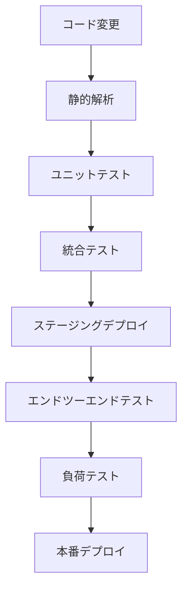

# Portfolio Market Data API テスト計画書

## 1. テスト戦略概要

このテスト計画は、リファクタリングされた Portfolio Market Data API の品質と信頼性を確保するためのものです。テストは以下の原則に基づいて設計・実行されます：

- **包括的カバレッジ**: コードベース全体をカバーする多層的なテスト戦略
- **自動化優先**: CI/CDパイプラインに統合できる自動テストを優先的に作成
- **変更箇所重点**: リファクタリングによる変更部分に特に注目したテスト設計
- **段階的実行**: 単体テストから始め、統合テスト、負荷テストと段階的にテストを進行

テストは4つの主要カテゴリに分けて実施します：ユニットテスト、統合テスト、エンドツーエンドテスト、負荷テストです。

## 2. ユニットテスト計画

### 2.1 ユニティリティモジュールのテスト

| テスト対象 | テスト内容 | 優先度 |
|------------|------------|--------|
| `responseUtils.js` | 成功レスポンス、エラーレスポンス、リダイレクトレスポンスの各フォーマット関数のテスト | 高 |
| `cookieParser.js` | Cookie解析・生成・削除機能のテスト | 高 |
| `budgetCheck.js` | 予算チェック機能とレスポンス修飾機能のテスト | 中 |
| `retry.js` | 再試行ロジックとバックオフ戦略のテスト | 中 |
| `errorHandler.js` | エラーハンドリングとエラーレスポンス生成機能のテスト | 高 |
| `dataFetchUtils.js` | ユーザーエージェント、ブラックリストチェック機能のテスト | 中 |

### 2.2 サービスモジュールのテスト

| テスト対象 | テスト内容 | 優先度 |
|------------|------------|--------|
| `cache.js` | キャッシュの取得・保存・削除・クリーンアップ機能のテスト | 高 |
| `alerts.js` | アラート通知機能のテスト | 中 |
| `usage.js` | 使用量カウント・チェック・リセット機能のテスト | 高 |
| `googleAuthService.js` | 認証・セッション・トークン管理機能のテスト | 高 |
| 各データソース（`yahooFinance.js`など） | データ取得機能のテスト | 中 |

### 2.3 モックとスタブの作成

- **AWS SDK モック**: DynamoDB、SNS、STSなどのAWSサービスのモック
- **外部API モック**: 外部データソースAPIのモック
- **環境変数スタブ**: テスト環境用の環境変数設定

### 2.4 テストスイート構成

```
__tests__/
  unit/
    utils/
      responseUtils.test.js
      cookieParser.test.js
      ...
    services/
      cache.test.js
      alerts.test.js
      ...
```

## 3. 統合テスト計画

### 3.1 ハンドラー関数のテスト

| テスト対象 | テスト内容 | 優先度 |
|------------|------------|--------|
| `marketData.js` | マーケットデータ取得ハンドラーのテスト | 高 |
| 認証関連ハンドラー | ログイン、ログアウト、セッション取得機能のテスト | 高 |
| Google Drive関連ハンドラー | ファイル保存・読み込み・一覧機能のテスト | 高 |
| 管理者機能ハンドラー | ステータス取得・使用量リセット機能のテスト | 中 |

### 3.2 エンドツーエンドフローのテスト

| テストフロー | テスト内容 | 優先度 |
|--------------|------------|--------|
| 認証フロー | ログイン、セッション検証、ログアウトの一連の流れ | 高 |
| データ取得フロー | キャッシュミス→データ取得→キャッシュヒットの流れ | 高 |
| Google Drive連携フロー | ファイル保存→一覧取得→ファイル読み込みの流れ | 中 |
| 管理者操作フロー | ステータス取得→使用量リセット→ステータス再取得の流れ | 中 |

### 3.3 API エンドポイントのテスト

各APIエンドポイントに対して以下のテストを実施:

- 正常系リクエスト
- 異常系リクエスト（不正パラメータ）
- 認証失敗のケース
- 制限超過のケース
- CORSヘッダーの確認

### 3.4 モックサーバーの構築

- **LocalStack**: AWSサービスのローカルエミュレーション
- **WireMock**: 外部APIのモック
- **インメモリデータベース**: DynamoDBのエミュレーション

## 4. 負荷テスト計画

### 4.1 パフォーマンステスト

| テスト対象 | テスト内容 | 目標値 | 優先度 |
|------------|------------|--------|--------|
| レスポンス時間 | 平均・95パーセンタイルレスポンス時間の測定 | 平均<500ms、95%<1000ms | 高 |
| スループット | 1秒あたりの処理可能リクエスト数 | >100req/s | 中 |
| コールドスタート | Lambda関数の初回起動時間 | <2000ms | 中 |

### 4.2 エンデュランステスト

- **持続的負荷**: 中程度の負荷（50req/s）を30分間維持
- **段階的負荷増加**: 10req/sから徐々に100req/sまで増加
- **回復テスト**: 高負荷後のシステム回復能力の検証

### 4.3 キャッシュ効率のテスト

- **キャッシュヒット率**: 異なるアクセスパターンでのヒット率測定
- **キャッシュサイズ**: 様々なサイズのデータに対するキャッシュ効率測定
- **キャッシュ無効化**: TTL期限切れとクリーンアップ処理のテスト

### 4.4 使用ツール

- **Artillery**: HTTP負荷テスト
- **AWS CloudWatch**: メトリクス収集
- **カスタムツール**: 特定シナリオのシミュレーション

## 5. テスト環境のセットアップ

### 5.1 ローカル開発環境

```bash
# Jest と必要なテストライブラリのインストール
npm install --save-dev jest aws-sdk-mock nock sinon supertest

# テスト設定ファイルの作成
cat > jest.config.js << EOF
module.exports = {
  testEnvironment: 'node',
  collectCoverage: true,
  coverageThreshold: {
    global: {
      branches: 70,
      functions: 80,
      lines: 80,
      statements: 80
    }
  },
  setupFiles: ['./jest.setup.js']
};
EOF

# AWS SDKモックセットアップ
cat > jest.setup.js << EOF
process.env.NODE_ENV = 'test';
process.env.AWS_REGION = 'us-east-1';
process.env.DYNAMODB_TABLE_PREFIX = 'test-';
process.env.CORS_ALLOW_ORIGIN = '*';
EOF
```

### 5.2 CI環境設定

```yaml
# .github/workflows/test.yml 例
name: Test

on:
  push:
    branches: [ main, develop ]
  pull_request:
    branches: [ main, develop ]

jobs:
  test:
    runs-on: ubuntu-latest
    
    steps:
    - uses: actions/checkout@v2
    - name: Use Node.js
      uses: actions/setup-node@v2
      with:
        node-version: '18.x'
    - name: Install dependencies
      run: npm ci
    - name: Run tests
      run: npm test
```

### 5.3 テスト用環境変数

```
# テスト用.env.test ファイル例
NODE_ENV=test
AWS_REGION=us-east-1
DYNAMODB_TABLE_PREFIX=test-portfolio-market-data-
DAILY_REQUEST_LIMIT=100
MONTHLY_REQUEST_LIMIT=1000
DISABLE_ON_LIMIT=true
GOOGLE_CLIENT_ID=test-client-id
GOOGLE_CLIENT_SECRET=test-client-secret
DRIVE_FOLDER_NAME=TestPortfolioManagerData
```

## 6. テストスケジュール

| フェーズ | 作業内容 | 期間 | 開始日 | 終了日 |
|---------|----------|------|--------|--------|
| 準備 | テスト環境構築、モック・スタブ作成 | 3日 | 2025/05/20 | 2025/05/22 |
| フェーズ1 | ユニットテスト実装・実行 | 5日 | 2025/05/23 | 2025/05/27 |
| フェーズ2 | 統合テスト実装・実行 | 5日 | 2025/05/28 | 2025/06/01 |
| フェーズ3 | エンドツーエンドテスト実装・実行 | 3日 | 2025/06/02 | 2025/06/04 |
| フェーズ4 | 負荷テスト実装・実行 | 3日 | 2025/06/05 | 2025/06/07 |
| フェーズ5 | 修正・再テスト | 3日 | 2025/06/08 | 2025/06/10 |
| レポート | テスト結果分析・レポート作成 | 2日 | 2025/06/11 | 2025/06/12 |

## 7. 合格基準

### 7.1 機能的基準

- **ユニットテスト**: 全テストケース成功、コードカバレッジ80%以上
- **統合テスト**: 全APIエンドポイントの正常・異常系テスト成功
- **エンドツーエンド**: 全ユーザーシナリオのテスト成功

### 7.2 非機能的基準

- **パフォーマンス**: 平均応答時間500ms未満、95パーセンタイル1000ms未満
- **スケーラビリティ**: 100req/秒の処理能力を維持
- **回復性**: 負荷後の正常動作回復時間5秒未満

### 7.3 リグレッション検証

- リファクタリング前と同等以上の機能性を維持
- 既存機能の破壊が発生していないことを確認

## 8. リスク管理とコンティンジェンシープラン

### 8.1 識別されたリスク

| リスク | 影響度 | 発生確率 | 対策 |
|--------|--------|----------|------|
| テスト漏れによる未検出バグ | 高 | 中 | カバレッジ測定強化、コードレビュー |
| 外部API依存によるテスト不安定性 | 中 | 高 | モックの強化、冪等性のあるテスト設計 |
| 環境差異によるテスト失敗 | 中 | 中 | Docker化、環境設定の明確化 |
| 負荷テスト中のコスト増大 | 低 | 高 | テスト時間制限、コスト監視 |

### 8.2 コンティンジェンシープラン

- **重大なバグ発見時**: デプロイを中断し、緊急フィックスチームを編成
- **テスト環境障害**: バックアップ環境への切り替え
- **スケジュール遅延**: クリティカルパステストを優先し、並行作業で遅延を最小化

## 9. テスト自動化とCIプロセス

### 9.1 CI/CDパイプライン統合



### 9.2 自動テスト実行設定

- **プッシュ時**: 静的解析・ユニットテスト自動実行
- **PRマージ時**: 統合テスト・エンドツーエンドテスト自動実行
- **定期実行**: 毎日夜間に全テスト実行

### 9.3 テスト結果レポート

- JUnitフォーマットでの結果出力
- テストカバレッジレポート自動生成
- Slackへの結果通知

## 10. テストコード例

### 10.1 ユニットテスト例（responseUtils.js）

```javascript
// __tests__/unit/utils/responseUtils.test.js
const { formatResponse, formatErrorResponse } = require('../../../src/utils/responseUtils');

describe('responseUtils', () => {
  // 環境変数のモック
  beforeEach(() => {
    process.env.CORS_ALLOW_ORIGIN = '*';
  });

  describe('formatResponse', () => {
    test('デフォルトパラメータでのレスポンスフォーマット', async () => {
      const response = await formatResponse({
        data: { message: 'Success' }
      });

      expect(response.statusCode).toBe(200);
      expect(response.headers['Content-Type']).toBe('application/json');
      expect(response.headers['Access-Control-Allow-Origin']).toBe('*');
      
      const body = JSON.parse(response.body);
      expect(body.success).toBe(true);
      expect(body.data.message).toBe('Success');
    });

    test('カスタムステータスコードとヘッダーでのレスポンスフォーマット', async () => {
      const response = await formatResponse({
        statusCode: 201,
        headers: { 'Custom-Header': 'Value' },
        data: { id: '123' }
      });

      expect(response.statusCode).toBe(201);
      expect(response.headers['Custom-Header']).toBe('Value');
      
      const body = JSON.parse(response.body);
      expect(body.data.id).toBe('123');
    });
  });

  describe('formatErrorResponse', () => {
    test('デフォルトエラーレスポンスフォーマット', async () => {
      const response = await formatErrorResponse({
        message: 'Error occurred'
      });

      expect(response.statusCode).toBe(500);
      
      const body = JSON.parse(response.body);
      expect(body.success).toBe(false);
      expect(body.error.message).toBe('Error occurred');
      expect(body.error.code).toBe('SERVER_ERROR');
    });

    test('カスタムエラーコードとステータスでのエラーレスポンスフォーマット', async () => {
      const response = await formatErrorResponse({
        statusCode: 400,
        code: 'INVALID_PARAMS',
        message: 'Invalid parameters',
        details: 'Missing required field'
      });

      expect(response.statusCode).toBe(400);
      
      const body = JSON.parse(response.body);
      expect(body.error.code).toBe('INVALID_PARAMS');
      expect(body.error.message).toBe('Invalid parameters');
      expect(body.error.details).toBe('Missing required field');
    });
  });
});
```

### 10.2 統合テスト例（googleLogin.js）

```javascript
// __tests__/integration/auth/googleLogin.test.js
const { handler } = require('../../../src/function/auth/googleLogin');
const googleAuthService = require('../../../src/services/googleAuthService');

// サービスをモック化
jest.mock('../../../src/services/googleAuthService');

describe('Google Login Handler', () => {
  beforeEach(() => {
    jest.resetAllMocks();
  });

  test('有効な認証コードでの正常ログイン', async () => {
    // モックの設定
    googleAuthService.exchangeCodeForTokens.mockResolvedValue({
      id_token: 'test-id-token',
      access_token: 'test-access-token',
      refresh_token: 'test-refresh-token',
      expires_in: 3600
    });
    
    googleAuthService.verifyIdToken.mockResolvedValue({
      sub: 'test-user-id',
      email: 'test@example.com',
      name: 'Test User',
      picture: 'https://example.com/picture.jpg'
    });
    
    googleAuthService.createUserSession.mockResolvedValue({
      sessionId: 'test-session-id',
      expiresAt: new Date(Date.now() + 7 * 24 * 60 * 60 * 1000).toISOString()
    });

    // テスト実行
    const event = {
      body: JSON.stringify({
        code: 'valid-auth-code',
        redirectUri: 'https://app.example.com/callback'
      })
    };

    const response = await handler(event);
    
    // レスポンス検証
    expect(response.statusCode).toBe(200);
    expect(response.headers['Set-Cookie']).toBeDefined();
    
    const body = JSON.parse(response.body);
    expect(body.success).toBe(true);
    expect(body.isAuthenticated).toBe(true);
    expect(body.user.email).toBe('test@example.com');
    
    // モック呼び出し検証
    expect(googleAuthService.exchangeCodeForTokens).toHaveBeenCalledWith(
      'valid-auth-code',
      'https://app.example.com/callback'
    );
  });

  test('認証コードなしでのエラーケース', async () => {
    // テスト実行
    const event = {
      body: JSON.stringify({
        redirectUri: 'https://app.example.com/callback'
      })
    };

    const response = await handler(event);
    
    // レスポンス検証
    expect(response.statusCode).toBe(400);
    
    const body = JSON.parse(response.body);
    expect(body.success).toBe(false);
    expect(body.error.code).toBe('INVALID_PARAMS');
    
    // モックが呼ばれていないことを検証
    expect(googleAuthService.exchangeCodeForTokens).not.toHaveBeenCalled();
  });

  test('トークン交換失敗時のエラーハンドリング', async () => {
    // モックの設定
    googleAuthService.exchangeCodeForTokens.mockRejectedValue(
      new Error('Invalid authorization code')
    );

    // テスト実行
    const event = {
      body: JSON.stringify({
        code: 'invalid-auth-code',
        redirectUri: 'https://app.example.com/callback'
      })
    };

    const response = await handler(event);
    
    // レスポンス検証
    expect(response.statusCode).toBe(401);
    
    const body = JSON.parse(response.body);
    expect(body.success).toBe(false);
    expect(body.error.code).toBe('AUTH_ERROR');
  });
});
```

## 11. テスト管理とレポーティング

### 11.1 テスト結果の管理

- **JUnit XMLレポート**: CI環境での結果保存・表示
- **HTMLレポート**: 視覚的なカバレッジレポート生成
- **テスト履歴**: 過去の実行結果と比較

### 11.2 品質ゲート

- **マージ前**: 全ユニットテスト・統合テスト合格必須
- **デプロイ前**: 全エンドツーエンドテスト合格必須
- **本番リリース前**: すべてのテスト合格・目標パフォーマンス達成必須
